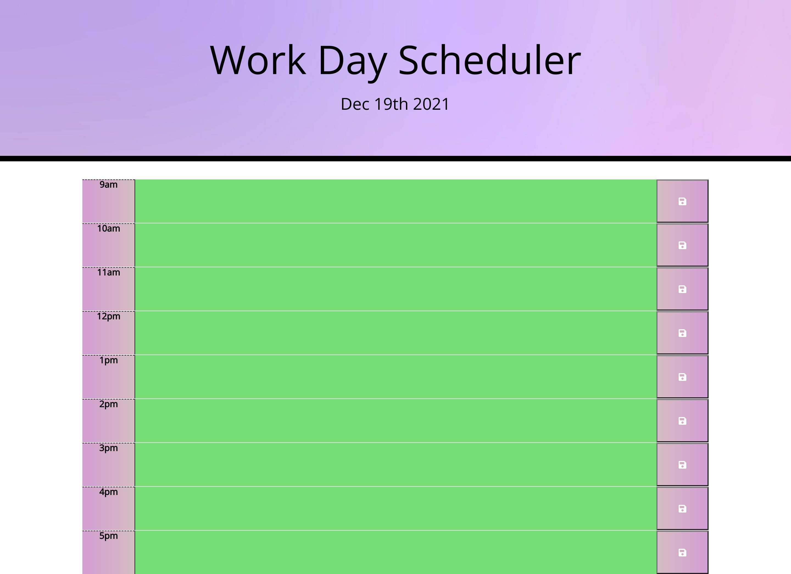

# **Work-Day-Scheduler**
## **Purpose**
+ This is a daily planner. User can add important work events so they can manage their time effectively.
+ This calendar display work hours 8AM- 5PM.
Current date is displayed on top of the page. 
+ Each time block is color coded to indicate wether it is in the past(grey), present(red), or future(green).
+ User can use save button to store their schedule in their local storage.

> 
## **Built With:**

+ HTML
+ CSS
+ JavaScript
+ JQuery
+ Bootstrap

## **Website** :
https://tracytran1189.github.io/Work-Day-Scheduler/

